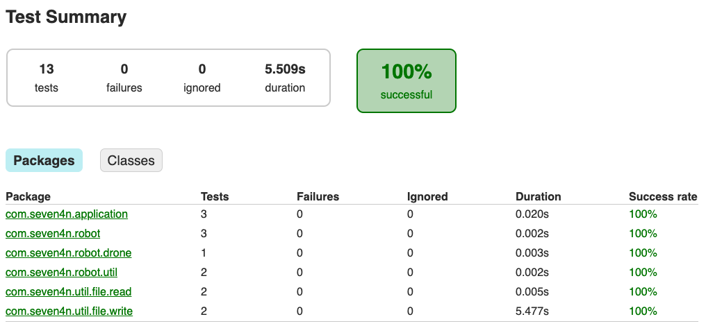

# About the project - s4n technical test
This is a simple java application which simulates the delivery of lunches using drones, to achieve this, the drones are 
feed with a file describing the routes each one should take, once the drones have finished their respective route, a 
result file will be left as the result 

# Requirements
Just one think:
- Java 8
- Gradle

# Folder Structure
```
.
├── src                                     # All the application sources are here
│   ├── main                                # The main application
│   │    ├── java                           # Where the full application is stored
│   │    └── resources                      # Just the home of the `application.yml` file
│   └── test                                # Home of the unit tests
├── gradle                                  # Gradle wrapper
└── *
```

# How to execute
The execution of the program is quite simple, first of all, prepare a folder with the configuration files for each drone.
Each configuration file name should follow this syntax `in[number].txt`, and its content will describe the drone trajectory
using the A for advance, L for a left turn and a R for a right turn.

To execute the program just use `./gradlew run` this will take the default example configuration files found in the 
`src/main/resources/robot/in` directory and will leave the output result in `src/main/resources/robot/out`, 
to specify your own input and output directory use `./gradlew run --args="-in {inputDir} -out {outputDir}"`

# Unit Tests
These can be found at the `src/test` folder. You can also execute the unit testing with `./gradlew test` the results 
will be generated at `build/reports/tests/test/index.html`

